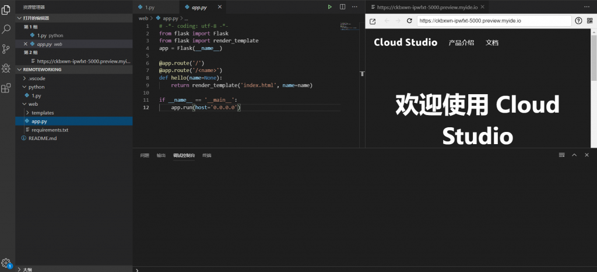
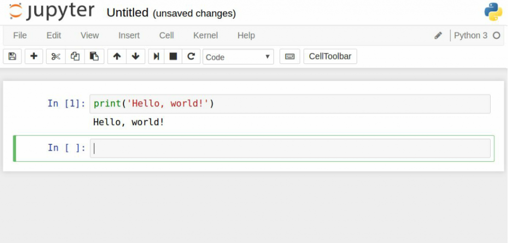
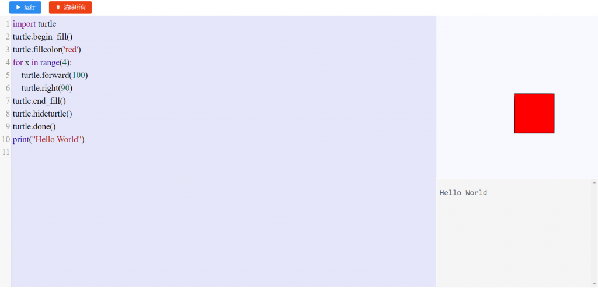
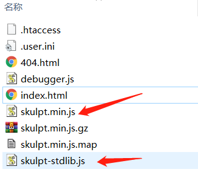
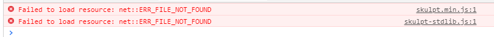
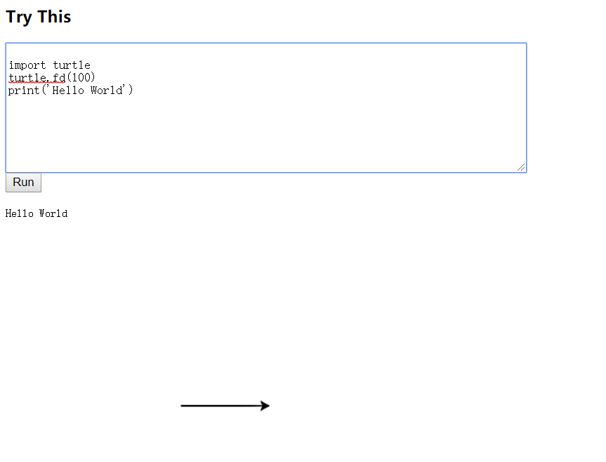

# Python_skulpt
你好，我是悦创。

基于 skulpt 开发的 Python online。


## 1. Python 在线编译器的解决方案

## 方案一：vscode web 版（vscode online）

大名鼎鼎的 vscode 推出了 web 版，也就是说可以在网页上进行编程了。

Github 地址：[https://github.com/microsoft/vscode](https://github.com/microsoft/vscode)

可以按照他的教程进行部署搭建到自己的服务器上。

PS：国内腾讯收购了 coding 。然后变成了现在的 coding.net 。传送门：[https://coding.net/](https://coding.net/)

他里面的 coding studio 和 vsconde 简直一毛一样。




## 方案二：Anaconda

Anoconda 包含了一个包管理工具和一个 Python 管理环境，同时附带了一大批常用数据科学包，也是数据分析的标配。其中里面的 jupyter notebook 可以实现在线编写 Python 的功能。




以上方案都不能满足的我要求，我和核心要求之一是要实现 Python turtle 画图。所以最终选择了 Skulpt。

Skulpt 是一个完全依靠浏览器端模拟实现 Python 运行的工具。可以依靠浏览器搭建出在线 Python 编译器。在线测试地址：xxxxxxxx




基于 Skulpt 的在线 Python 编译最终实现效果


## 2. 下载 Skulpt 与安装

GitHub 地址：[https://github.com/skulpt/skulpt](https://github.com/skulpt/skulpt)

主要是需要 dist 目录下的 `skulpt.min.js` 和 `skulpt-stdlib.js` 这两个文件：



dist 目录下还有一个index 文件，这个就是启动文件。如果我们双击运行后，界面是这样的：


这便是一个最基础的界面。但是还有问题， 这个时候你在这里面写python代码并点击“Run”是会报错的。主要原因是因为引用问题



引用部分如下：

```
<script src="../skulpt.min.js" type="text/javascript"></script> 
<script src="../skulpt-stdlib.js" type="text/javascript"></script> 
```

将代码中的第9行和第10行修改为如下形式：

```
<script src="skulpt.min.js" type="text/javascript"></script> 
<script src="skulpt-stdlib.js" type="text/javascript"></script> 
```

这个时候再运行index.html，并在框中输入python 代码点击运行便可出现效果。


